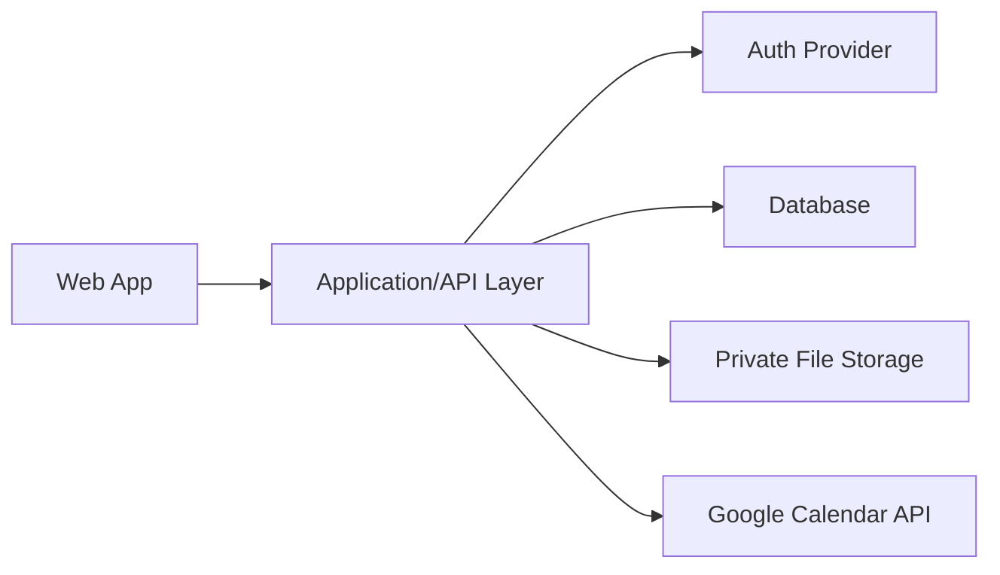

# Architecture Plan

This document captures the intended architecture shape for the MVP and the current implementation direction.

## Architecture Goals

- Simple enough for one person to build and operate during a family/friends pilot.
- Conventional enough to become SaaS-ready later.
- Strong private user data boundaries.
- Good support for file uploads and Google Calendar sync.
- Responsive web UI optimized for iPad/tablet, with phone and desktop support.

## Recommended Shape

## Frontend

The frontend should prioritize:

- Dashboard-first experience.
- Responsive tablet layout.
- Visual status cards.
- Guided onboarding checklist.
- Structured forms with dropdowns, date pickers, year selectors, and currency inputs.
- Optional upload controls that do not dominate onboarding.

### Current Frontend Implementation

The current web scaffold uses the Next.js App Router under `src/app`.

Implemented so far:

- Static dashboard shell in `src/app/page.tsx`.
- Root layout and global Tailwind CSS.
- Local shadcn/ui-style primitives for buttons, badges, and cards.
- Typed placeholder domain models in `src/types/home.ts`.
- Dashboard status metadata for Good, Due Soon, Needs Attention, and Missing Info.

This is intentionally static until authentication, schema, and Supabase-backed data access are implemented.

## Backend

The backend should support:

- Authenticated user-owned data.
- CRUD for properties, rooms, assets/systems, work records, reminders, contractors, and documents.
- Reminder calculation and dashboard status calculation.
- Google Calendar event creation and future update support.
- Protected file upload metadata and access rules.

### Current Backend Implementation

Supabase dependencies are installed and helper modules exist for future browser/server client creation:

- `src/lib/supabase/client.ts`
- `src/lib/supabase/server.ts`
- `src/lib/env.ts`

No Supabase project, database schema, auth flow, storage bucket, or Google Calendar route has been implemented yet.

## Data Storage

The data store should support relational links between users, properties, assets, work records, reminders, documents, and contractors. A relational database is the natural fit.

## File Storage

Files should be stored privately. Document records should store metadata and a protected URL or storage key, not public access by default.

## Calendar Integration

Calendar sync should store provider event IDs so the app can later update or delete calendar events cleanly.

Early implementation can start with one-way push from app reminder to Google Calendar. Two-way sync can wait.

## Deployment

Pilot deployment should favor a simple hosted setup with:

- Managed database.
- Managed auth or a well-supported auth framework.
- Private storage.
- Basic backups.
- Easy rollback/deploy workflow.

## Selected Technical Direction

- Language: TypeScript.
- Web framework: Next.js with React.
- Styling/UI: Tailwind CSS with shadcn/ui-style local components.
- Backend platform: Supabase.
- Database: PostgreSQL through Supabase.
- Auth provider: Supabase Auth.
- File storage: Supabase Storage with private buckets.
- Calendar integration: Google Calendar API through server-side routes/functions.
- Future iOS path: Expo React Native with TypeScript.
- Deployment direction: Vercel for the web app and Supabase managed hosting for backend services.

## Remaining Technical Decisions

- Exact Supabase vs Next.js server-route split for reminder calculations.
- Whether to use Prisma after the first schema stabilizes.
- Exact set of shadcn/ui components to add as flows are implemented.
- Exact deployment account/provider choices.
