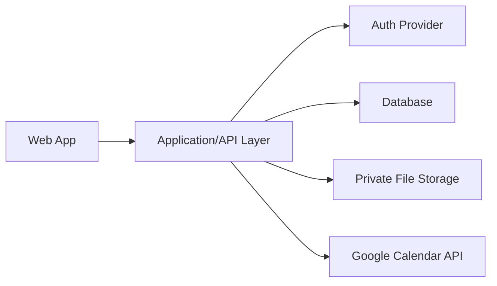

# Architecture Plan

This document captures the intended architecture shape for the MVP and the current implementation direction.

## Architecture Goals

- Simple enough for one person to build and operate during a family/friends pilot.
- Conventional enough to become SaaS-ready later.
- Strong private user data boundaries.
- Good support for file uploads and Google Calendar sync.
- Mobile-first responsive web UI with phone support as the primary constraint, while still scaling to tablet and desktop.

## Recommended Shape

## Frontend

The frontend should prioritize:

- Dashboard-first experience.
- Focused mobile app sections instead of one long dashboard on phones.
- Responsive tablet and desktop layouts.
- Visual status cards.
- Guided starter add flow for home inventory.
- Structured forms with dropdowns, date pickers, year selectors, and currency inputs.
- Optional upload controls that do not dominate onboarding.

### Current Frontend Implementation

The current web scaffold uses the Next.js App Router under `src/app`.

Implemented so far:

- Protected dashboard shell in `src/app/dashboard/page.tsx`.
- Auth entry screen in `src/app/login/page.tsx`.
- Root session-aware redirect in `src/app/page.tsx`.
- Root layout and global Tailwind CSS.
- Local shadcn/ui-style primitives for buttons, badges, and cards.
- Typed placeholder domain models in `src/types/home.ts`.
- Dashboard status metadata for Good, Due Soon, Needs Attention, and Missing Info.
- Guided asset/system starter flow for properties with no assets.
- Data-backed visual asset/system rows for created inventory records.
- Reopenable Add flow with compact multi-select starter tiles, specific heating/cooling choices, Popular picks, and expandable More home items.
- Mobile-first dashboard tabs for Home, Systems, Add, and More.
- Phone bottom navigation with desktop segmented navigation.
- Focused Systems detail view at `/dashboard?tab=systems&asset=<id>`.
- Focused asset detail forms backed by server actions.
- Authenticated mobile screenshot QA for Home, Add, Systems, and Asset Detail.

Dashboard property context and asset/system rows are backed by Supabase.

## Backend

The backend should support:

- Authenticated user-owned data.
- CRUD for properties, rooms, assets/systems, work records, reminders, contractors, and documents.
- Reminder calculation and dashboard status calculation.
- Google Calendar event creation and future update support.
- Protected file upload metadata and access rules.

### Current Backend Implementation

Supabase dependencies are installed and helper modules exist for future browser/server client creation:

- `src/lib/supabase/client.ts`
- `src/lib/supabase/server.ts`
- `src/lib/supabase/middleware.ts`
- `src/lib/env.ts`
- `src/lib/auth.ts`

Email/password auth flow, protected route handling, the initial schema migration, and real Supabase connectivity are implemented. No storage bucket, upload flow, work-record schema, reminder schema, contractor schema, document schema, or Google Calendar route has been implemented yet.

### Current Data Implementation

Implemented:

- `supabase/migrations/202606040001_initial_home_schema.sql`.
- RLS-enabled `profiles`, `properties`, `rooms`, and `asset_systems`.
- Placeholder generated-style types in `src/types/database.ts`.
- First-property setup server action in `src/app/dashboard/actions.ts`.
- Add-property and active-property detail update server actions in `src/app/dashboard/actions.ts`.
- Dashboard query for all signed-in user properties, with active property selection from `property=<id>`.
- Guided starter asset write path in `src/app/dashboard/actions.ts`.
- Asset detail update action in `src/app/dashboard/actions.ts`.
- Dashboard query for the active property's asset systems.
- Custom asset/system creation from the inventory panel.
- Selected-item Add review client flow for quantities and custom names before bulk asset/system creation.
- Focused detail editing for maintenance interval and next-service-due-date.
- Focused detail editing for asset identity, lifecycle, replacement-cost, and ownership-responsibility.
- Typed-confirmation asset/system removal.
- Dashboard status calculation based on missing detail state, condition, and due dates.
- First HomeKeep Modern Care dashboard UI pass with a home health score card, upcoming maintenance list, quick actions, visual home-system rows, focused asset detail views, and first mobile polish pass.
- `npm run verify:supabase` confirms the initial tables are reachable.
- A test Supabase user/property write path has been verified through RLS.
- A test asset-system write path has been verified through RLS.
- A test asset-system detail update path has been verified through RLS.

## Data Storage

The data store should support relational links between users, properties, assets, work records, reminders, documents, and contractors. A relational database is the natural fit.

## File Storage

Files should be stored privately. Document records should store metadata and a protected URL or storage key, not public access by default.

## Calendar Integration

Calendar sync should store provider event IDs so the app can later update or delete calendar events cleanly.

Early implementation can start with one-way push from app reminder to Google Calendar. Two-way sync can wait.

## Deployment

Pilot deployment should favor a simple hosted setup with:

- Managed database.
- Managed auth or a well-supported auth framework.
- Private storage.
- Basic backups.
- Easy rollback/deploy workflow.

## Selected Technical Direction

- Language: TypeScript.
- Web framework: Next.js with React.
- Styling/UI: Tailwind CSS with shadcn/ui-style local components.
- Backend platform: Supabase.
- Database: PostgreSQL through Supabase.
- Auth provider: Supabase Auth.
- File storage: Supabase Storage with private buckets.
- Calendar integration: Google Calendar API through server-side routes/functions.
- Future iOS path: Expo React Native with TypeScript.
- Deployment direction: Vercel for the web app and Supabase managed hosting for backend services.

## Remaining Technical Decisions

- Exact Supabase vs Next.js server-route split for reminder calculations.
- Whether to use Prisma after the first schema stabilizes.
- Exact set of shadcn/ui components to add as flows are implemented.
- Exact deployment account/provider choices.
