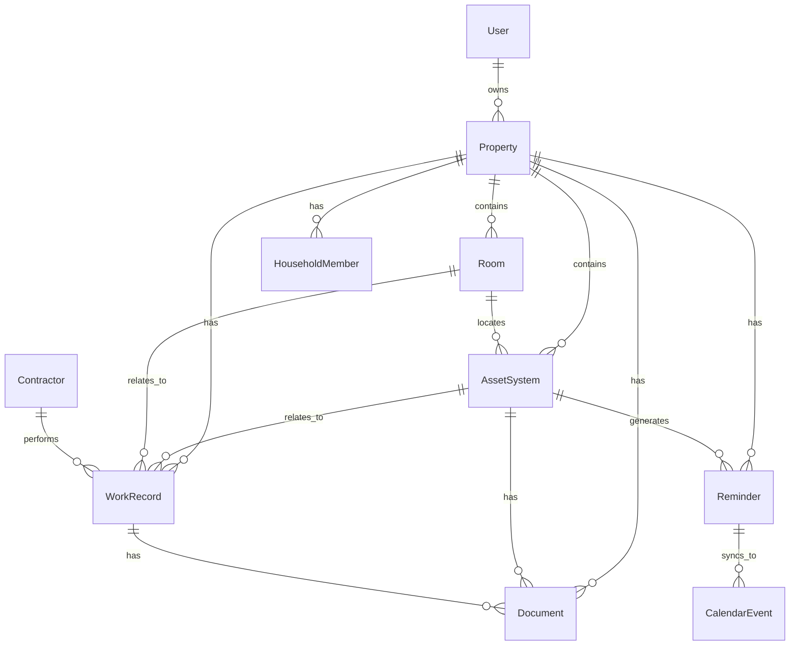

# Data Model

This is the planned MVP data model. The implemented schema currently covers `profiles`, `properties`, `rooms`, `asset_systems`, and `work_records`.

Current migrations:

```text
supabase/migrations/202606040001_initial_home_schema.sql
supabase/migrations/202606040002_dedupe_asset_systems.sql
supabase/migrations/202607280001_work_records.sql
```

Current placeholder TypeScript database types:

```text
src/types/database.ts
```

## Entity Relationship Overview



## User

- id
- name
- email
- created_at
- updated_at

## Property

- id
- user_id
- name
- property_type
- address_line_1
- address_line_2
- city
- state
- postal_code
- country
- year_built
- square_feet
- notes
- created_at
- updated_at

## Room

- id
- property_id
- name
- room_type
- notes
- created_at
- updated_at

## AssetSystem

- id
- property_id
- room_id nullable
- name: user-facing recognizable item name, such as Refrigerator, Garage refrigerator, Upstairs AC, Basement furnace, or Back deck
- category: structured grouping such as appliance, hvac, deck, roof, or water_heater
- brand
- model
- serial_number
- install_year nullable
- install_date nullable
- estimated_age_range nullable
- last_service_date nullable
- next_service_due_date nullable
- maintenance_interval_value nullable
- maintenance_interval_unit nullable
- expected_lifespan_years nullable
- condition
- status
- estimated_replacement_cost nullable
- ownership_responsibility
- notes
- created_at
- updated_at

Current duplicate rule:

- Multiple same-type assets are allowed when they have distinct names.
- Exact duplicates are blocked per property by `category + normalized name`.
- Examples that can coexist: `appliance:Kitchen refrigerator`, `appliance:Garage refrigerator`, `deck:Back deck`, `deck:Pool deck`.

## WorkRecord

- id
- property_id
- asset_system_id nullable
- room_id nullable
- contractor_id nullable
- performed_by_type
- title
- work_type
- description
- completed_date
- cost_amount nullable
- cost_currency
- notes
- created_at
- updated_at

## Reminder

- id
- property_id
- asset_system_id nullable
- work_record_id nullable
- title
- reminder_type
- due_date
- recurrence_rule nullable
- season nullable
- status
- priority
- calendar_sync_enabled
- created_at
- updated_at

## CalendarEvent

- id
- reminder_id
- provider
- provider_calendar_id nullable
- provider_event_id
- sync_status
- last_synced_at nullable
- created_at
- updated_at

## Contractor

- id
- user_id
- company_name
- contact_name
- trade_category
- phone
- email
- website
- rating nullable
- would_use_again nullable
- notes
- created_at
- updated_at

## HouseholdMember

- id
- property_id
- name
- email nullable
- role
- created_at
- updated_at

## Document

- id
- property_id
- asset_system_id nullable
- room_id nullable
- work_record_id nullable
- contractor_id nullable
- file_url
- file_name
- file_type
- document_type
- notes
- created_at
- updated_at

## Key Enums

### property_type

- single_family_house
- condo
- coop
- apartment
- multi_family
- rental
- vacation_home
- other

### asset_system_category

- roof
- hvac
- furnace
- boiler
- water_heater
- appliance
- electrical
- plumbing
- gutters
- windows
- chimney
- foundation
- deck
- driveway
- pool
- sump_pump
- septic_or_sewer
- irrigation
- garage
- security
- other

### estimated_age_range

- zero_to_three_years
- four_to_seven_years
- eight_to_twelve_years
- thirteen_to_twenty_years
- over_twenty_years
- unknown

### condition

- excellent
- good
- fair
- poor
- unknown

### status

- good
- due_soon
- needs_attention
- missing_info

### work_type

- maintenance
- repair
- inspection
- replacement
- installation
- upgrade
- cleaning
- diy
- contractor_visit
- other

### reminder_type

- one_time
- recurring
- seasonal
- review
- replacement_planning

### reminder_status

- active
- completed
- skipped
- snoozed
